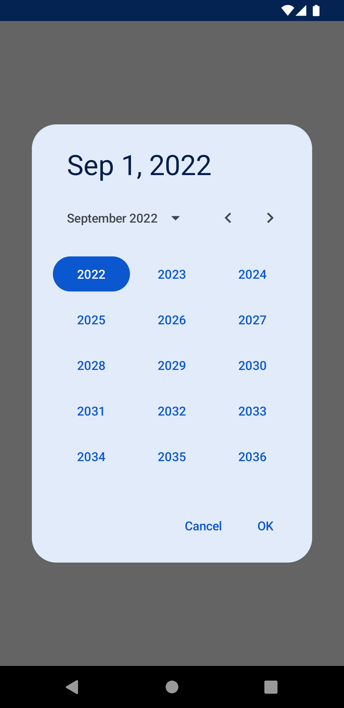

# ComposeCalendar

This library provides a beautiful date picker for Jetpack Compose, following the latest material 3 guidelines.




## Dependency

Make sure to add Maven Central to your repositories declarations:

```groovy
repositories {
    mavenCentral()
}
```

then add the latest ComposeCalendar version to your `app/build.gradle` file dependencies:

```groovy
dependencies {
    implementation 'com.squaredem:composecalendar:1.1.0'
}
```

## How to use

Showing the calendar:

```kotlin
// first declare a variable that holds the dialog visibility state
val showDialog = rememberSaveable { mutableStateOf(false) }

// then show the dialog based on the state
if (showDialog.value) {
    ComposeCalendar(
        onDone = { it: LocalDate ->
            // Hide dialog
            showDialog.value = false
            // Do something with the date
        },
        onDismiss = {
            // Hide dialog
            showDialog.value = false
        }
    )
}
```

### Start date and interval

You can customize start, min and max dates. By default these are set as:

```kotlin
ComposeCalendar(
    startDate = LocalDate.now(),
    minDate = LocalDate.now(),
    maxDate = LocalDate.MAX,
    ...
)
```

> Note: currently min and max dates are being coerced respectively to year **1900** and **2100**.

### Top bar customization

You can choose whether to show or hide the top bar with the selected date.
You can also pass a custom `DateFormat` for the string.

```kotlin
ComposeCalendar(
    ...
    showSelectedDate = true,
    selectedDateFormat = DateFormat.getDateInstance(DateFormat.DEFAULT)
)
```

## What's next

- Date range selection (from date A to date B)
- Customizations (fonts, colors, date intervals)
- ...

I am open to suggestions! Please share your ideas and your needs.

## License

ComposeCalendar is distributed under the terms of the Apache License (Version 2.0). See the [license](LICENSE) for more information.
